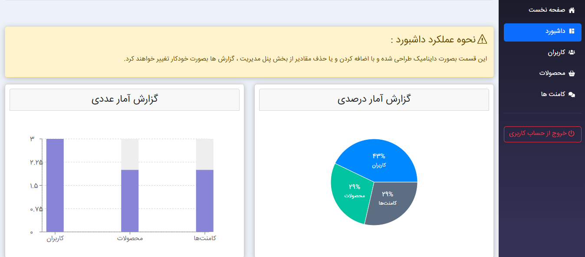
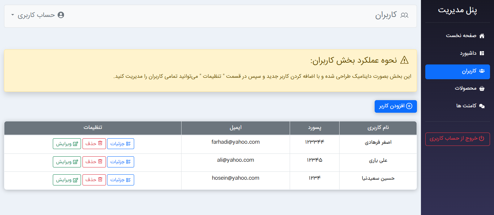
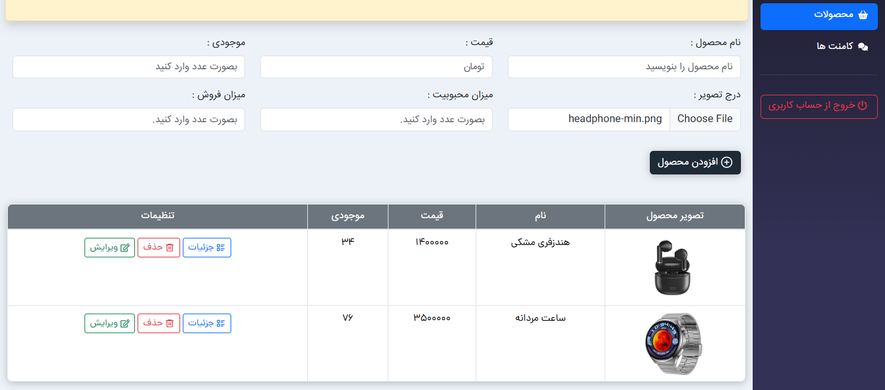
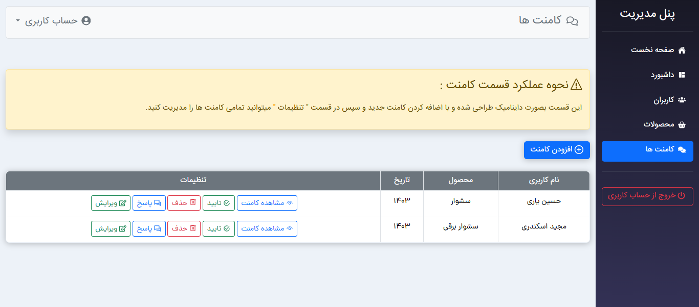

  

## ⚡&nbsp; View Online
Click Here : https://cms-react-panel.vercel.app/

## ✨&nbsp; Dashboard Page

## 🎨 Project Showcase

|                                                                                    Dashboard Page                                                                                     |                                                                                   Users Page                                                                                   |                                                                                Products Page                                                                                |                                                                             Comments Page                                                                              |
| :--------------------------------------------------------------------------------------------------------------------------------------------------------------------------------------: | :----------------------------------------------------------------------------------------------------------------------------------------------------------------------------------: | :----------------------------------------------------------------------------------------------------------------------------------------------------------------------------------------: | :----------------------------------------------------------------------------------------------------------------------------------------------------------------------------------------: |
|  |  |  |  |

## 🚀&nbsp; Programming Language And Tools Used 
     

## 📘&nbsp; Description
Online Store Management Counter. This admin panel is designed dynamically with the popular React language and Bootstrap framework, along with a backend that I set up with a Json server that has the ability to store and edit information.

## 📫&nbsp; Have a question? Want to chat? Ran into a problem?
I would be happy to contact you and if you have any questions about my project, please ask me and I will answer as soon as possible.
My Email Address: Dostalivand.Hosein@gmail.com
My ID Telegram: https://t.me/hoseindav

## ❤️&nbsp; Links
* [GitHub](https://github.com/Dostalivand)
* [Email](dostalivand.hosein@gmail.com)
* [Follow on Instagram](https://instagram.com/hosein.css/)
* [Follow on Linkedin](https://linkedin.com/in/dostalivand)

  

